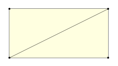
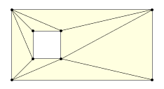
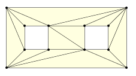
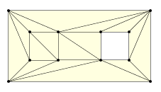
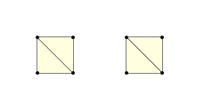
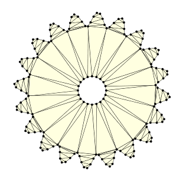
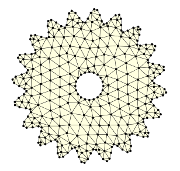

cdt.js
======
**拘束ドロネー三角形分割 (Constrained Delaunay Triangulation) に基づいた二次元三角形分割のJavaScriptライブラリ**

`cdt.js`は，二次元空間における境界内部を三角形分割する関数を提供します．三角形分割のアルゴリズムは，『谷口健男著，FEMのための要素自動分割，森北出版』を参考にした，拘束ドロネー三角分割 (Constrained Delaunay Triangulation, CDT) に基づいて実装されています．二次元空間における分割対象領域を多角形で合わらわされる境界で定義し，その内部を三角形分割します．領域内部への節点追加配置にも対応し，簡易的な有限要素法 (Finite Element Method, FEM) のプリプロセッサとして用いることもできます．


## License
* MIT
    * see LICENSE

Install
---
`dist/cdt-0.1.min.js` を直接読み込んで使用します．
```html
<script type='text/javascript' src='cdt.js'></script>
```


Usege
---
ライブラリと称していますが関数はひとつしかありません．
```javascript
function cdt(boundaryPolygons, holeBoundaryPolygons, option) -> result
```
`arg1` `boundaryPolygons`: 「境界を表す多角形の頂点座標配列」の配列.
`arg2` `holeBoundaryPolygons`: 「穴境界を表す多角形の頂点座標配列」の配列.
`arg3` `option`: 省略可能．詳細は例にて説明．
`return value` `result`: プロパティ`points`に全頂点の座標，プロパティ`connectivity`に
Example - Single boundary
---
1. 入力データの準備
分割対象領域を定義する境界を，多角形頂点座標の配列として準備します．
例えば，4点 (100, 100), (300, 100), (300, 200), (100, 200) を頂点とする多角形（四角形）の場合，以下のように配列を作成します．
```javascript
var polygonPoints0 = [[100, 100], [300, 100], [300, 200], [100, 200]];	// 長方形の頂点座標配列
```
多角形の境界が自己交差しないよう注意してください．`cdt.js`は境界に交差がないことを前提としており，エラー処理や交差チェックは未実装です．

2. 三角形分割の実行
領域を三角形分割するには，以下のように関数`cdt`を呼びます．
```javascript
var result = cdt([polygonPoints0], []);
```
`cdt`の第一引数を`Array` of `Array`として渡すのは，後述の複数境界のデータ形式と合わせるためです．
第二引数は穴の境界多角形の頂点座標を与えますが，ここでは空配列を渡しています（現状では省略できません）．
複数境界，穴の追加については後述します．

3. 結果の取り出し
分割結果は以下のように取り出します．
```javascript
var points = result.points;
var conn = result.connectivity;
```
ここで，`points`は頂点座標を格納した配列で，この例の場合，`polygonPoints0`と同じ値を持ちます．
`conn`は三角形の結合情報を表すコネクティビティ配列です．
例えば，i番目の三角形の頂点座標は以下のようにアクセスします．
```javascript
p0 = points[conn[i][0]];
p1 = points[conn[i][1]];
p2 = points[conn[i][2]];
```
この例の分割結果は下の図のようになります．



Example - Hole boundary
---
通常境界と同様に，穴境界についても頂点座標の配列を作成します．
例えば，上記の長方形に加えて，小さい四角形の頂点座標配列を以下のように作成します．
```javascript
var polygonPoints0 = [[100, 100], [300, 100], [300, 200], [100, 200]];	// 長方形の頂点座標配列
var polygonPoints1 = [[170, 170], [130, 170], [130, 130], [170, 130]];	// 小さい四角形の頂点座標配列
```
三角形分割するには，`cdt`の第二引数に`polygonPoints1`を渡します．
```javascript
var result = cdt([polygonPoints0],[polygonPoints1]);
```
結果の取り出しは Single boundary の場合と同様です．
分割結果は以下のようになります．



Example - Multiple boundary
---
以下のように`polygonPoints0`, `polygonPoints1`, `hpolygonPoints2` を作成したとします．
```javascript
var polygonPoints0 = [[100, 100], [300, 100], [300, 200], [100, 200]];	// 大きい長方形
var polygonPoints1 = [[170, 170], [130, 170], [130, 130], [170, 130]];	// 小さい正方形（左寄り）
var polygonPoints2 = [[270, 170], [230, 170], [230, 130], [270, 130]];	// 小さい正方形（右寄り）
```
`polygonPoints0`によって外部境界を，`polygonPoints1`, `polygonPoints2`によって穴境界を定義したい場合，以下のような配列を作成します．
```javascript
var boundary = [polygonPoints0];
var holeBoundary = [polygonPoints1, polygonPoints2];
```
三角形分割は`cdt()`を以下のように呼び出します．
```javascript
var result = cdt(bounday, holeBoundary);
```
分割結果は大きい長方形の内部に二つの小さい穴が生成されます．



`polygonPoints0`と`polygonPoints1`によって外部境界を，`polygonPoints2`によって穴境界を定義したい場合，以下のような配列を作成します．
```javascript
var boundary = [polygonPoints0, polygonPoints1];
var holeBoundary = [polygonPoints2];
```
分割結果は下のようになります．



このように外部境界が他の境界の内側にある場合は，その境界上の辺が分割後も保存されるように分割されます．このような分割が求めらえれるFEMのメッシュ分割にも用いることができます．

次に`polygonPoints1`と`polygonPoints2`によって外部境界を作成する場合，
以下のように配列を作成します．
```javascript
var boundary = [polygonPoints1, polygonPoints2];
var holeBoundary = [];
```
分割結果は以下のようになります．



外部境界が分離している場合でも，`result.points`, `result.connectivity`にひとまとめに結果が出力されます．

Example - Inner points addition
---
FEMのための解析用メッシュに用いるには，領域内部を詳細に三角形分割をすることが求められます．
例えば，歯車のような形状の境界データが得られているとします．
これを以下のようにして分割すると，下の図のような境界が得られます．
```javacrtipt
cdt(boundary, holeBounday);
```



領域内部をより詳細に分割する場合は，以下のように`option`を与えることで自動的に領域内部に節点を配置して分割します．
```javascript
var option = {triSize: 'auto'}
cdt(boundary, holeBounday, option);
```



`option`のプロパティ`triSize`に数値を設定すると，大まかな三角形の辺のサイズを指定することができます．`auto`に設定すると入力した境界の辺の長さを平均した値に基づいて自動的に`triSize`を内部で生成します．


## Author

Kazuya Sase (http://sasekazu.info/)