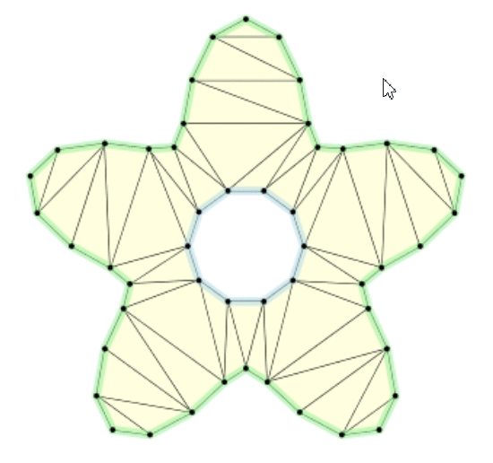
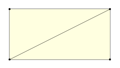
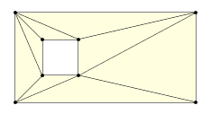
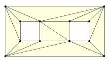
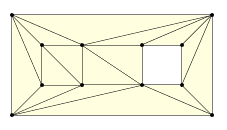
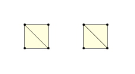
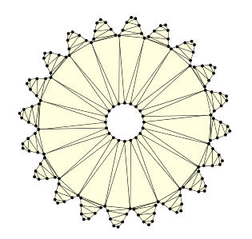
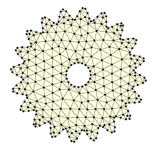

cdt.js
======
**Two-Dimensional Triangulation in JavaScript (Constrained Delaunay Triangulation)**

`cdt.js` provides a function for triangulating the interior of boundaries in two-dimensional space. The triangulation algorithm is implemented based on Constrained Delaunay Triangulation (CDT), referencing "Takeo Taniguchi, Automatic Element Subdivision for FEM, Morikita Publishing" (谷口健男，FEMのための要素自動分割，森北出版). The region to be subdivided is defined by polygon boundaries. It also supports the placement of additional nodes inside the region, and can be used as a simple preprocessor for the Finite Element Method (FEM).


License
---
* MIT
    * see LICENSE

Demo
---
[Interactive demo](http://sasekazu.github.io/cdt.js/example/interactive-demo)



Install
---
Directly load and use `dist/cdt-0.1.min.js`.
```html
<script type='text/javascript' src='cdt.js'></script>
```


Usage
---
Only one function is provided:
```javascript
function cdt(boundaryPolygons, holeBoundaryPolygons, option) -> result
```
`arg1` `boundaryPolygons`: Array of "arrays of polygon vertex coordinates representing boundaries".
`arg2` `holeBoundaryPolygons`: Array of "arrays of polygon vertex coordinates representing hole boundaries".
`arg3` `option`: Optional. Details explained in Examples.
`return value` `result`: Object containing the results.
`return value` `result.points`: Coordinates of all vertices.
`return value` `result.connectivity`: List of vertex IDs that compose the triangles.


Example - Single boundary
---
1. Prepare input data
Prepare the boundary as an array of polygon vertex coordinates.
For example, for a polygon (rectangle) with 4 vertices at (100, 100), (300, 100), (300, 200), (100, 200), create an array as follows:
```javascript
var polygonPoints0 = [[100, 100], [300, 100], [300, 200], [100, 200]];	// Coordinates of vertices of a rectangle
```
Please ensure that the polygon boundaries do not self-intersect. `cdt.js` assumes there are no boundary intersections, and error handling and intersection checks are not implemented.

1. Execute triangulation
To triangulate the region, call the `cdt` function as follows:
```javascript
var result = cdt([polygonPoints0], []);
```
The first argument of `cdt` is passed as an `Array` of `Array` to match the data format for multiple boundaries described later.
The second argument provides the vertex coordinates of hole boundary polygons, but here we pass an empty array (currently cannot be omitted).
Multiple boundaries and adding holes are described later.

1. Extract results
Extract the triangulation results as follows:
```javascript
var points = result.points;
var conn = result.connectivity;
```
Here, `points` is an array containing vertex coordinates, and in this example, has the same values as `polygonPoints0`.
`conn` is a connectivity array representing the connection information of triangles.
For example, the vertex coordinates of the i-th triangle can be accessed as follows:
```javascript
p0 = points[conn[i][0]];
p1 = points[conn[i][1]];
p2 = points[conn[i][2]];
```
The triangulation result for this example is shown in the figure below.



Example - Hole boundary
---
As with regular boundaries, create an array of vertex coordinates for hole boundaries as well.
For example, in addition to the above rectangle, create a vertex coordinate array for a small square as follows:
```javascript
var polygonPoints0 = [[100, 100], [300, 100], [300, 200], [100, 200]];	// Large rectangle
var polygonPoints1 = [[170, 170], [130, 170], [130, 130], [170, 130]];	// Small square
```
To triangulate, pass `polygonPoints1` as the second argument to `cdt`:
```javascript
var result = cdt([polygonPoints0],[polygonPoints1]);
```
Extracting results is the same as in the single boundary case.
The triangulation result is as follows:



Example - Multiple boundary
---
Suppose you have created `polygonPoints0`, `polygonPoints1`, and `polygonPoints2` as follows:
```javascript
var polygonPoints0 = [[100, 100], [300, 100], [300, 200], [100, 200]];	// Large rectangle
var polygonPoints1 = [[170, 170], [130, 170], [130, 130], [170, 130]];	// Small square (left)
var polygonPoints2 = [[270, 170], [230, 170], [230, 130], [270, 130]];	// Small square (right）
```
If you want to define the outer boundary with `polygonPoints0` and hole boundaries with `polygonPoints1` and `polygonPoints2`, create arrays as follows:
```javascript
var boundary = [polygonPoints0];
var holeBoundary = [polygonPoints1, polygonPoints2];
```
Call `cdt()` for triangulation as follows:
```javascript
var result = cdt(boundary, holeBoundary);
```
The triangulation result generates two small holes inside the large rectangle.



If you want to define the outer boundaries with `polygonPoints0` and `polygonPoints1`, and the hole boundary with `polygonPoints2`, create arrays as follows:
```javascript
var boundary = [polygonPoints0, polygonPoints1];
var holeBoundary = [polygonPoints2];
```
The triangulation result will be as shown below.



When an outer boundary is inside another boundary like this, the triangulation preserves the edges on that boundary after subdivision.

Next, when creating outer boundaries with `polygonPoints1` and `polygonPoints2`,
create arrays as follows:
```javascript
var boundary = [polygonPoints1, polygonPoints2];
var holeBoundary = [];
```
The triangulation result will be as follows:



Even when outer boundaries are separated, the combined result is output to `result.points` and `result.connectivity`.

Example - Inner points addition
---
For use as an analysis mesh for FEM, detailed triangulation inside the region is required.
For example, suppose you have boundary data for a gear-shaped region.
When you triangulate it as follows, you get the boundary shown in the figure below:
```javascript
cdt(boundary, holeboundary);
```



For more detailed subdivision inside the region, provide `option` as follows to automatically place nodes inside the region and subdivide:
```javascript
var option = {triSize: 'auto'}
cdt(boundary, holeboundary, option);
```



Setting a numeric value for the `triSize` property in `option` allows you to specify the approximate size of triangle edges. Setting it to `auto` automatically generates `triSize` internally based on the average length of the input boundary edges.

Code 
---
[Code (Rectangles)](http://sasekazu.github.io/cdt.js/example/minimum)
```javascript
<!DOCTYPE html>
<html xmlns="http://www.w3.org/1999/xhtml">
<head>
    <title>cdt.js minimum</title>
	<script type="text/javascript" src="cdt-0.1.min.js"></script>
	<script>
		window.onload = function () {

			// input data
			var polygonPoints0 = [[100, 100], [300, 100], [300, 200], [100, 200]];  // Large rectangle
			var polygonPoints1 = [[170, 170], [130, 170], [130, 130], [170, 130]];  // Small square (left)
			var polygonPoints2 = [[270, 170], [230, 170], [230, 130], [270, 130]];  // Small square (right)
			var boundary = [polygonPoints0];
			var holeBoundary = [polygonPoints1, polygonPoints2];

			// triangulate
			var result = cdt(boundary, holeBoundary);
			var points = result.points;
			var conn = result.connectivity;

			// create canvas
			var canvas = document.createElement("canvas");
			canvas.width = '400';
			canvas.height = '300';
			document.body.appendChild(canvas);
			var context = canvas.getContext('2d');

			// draw points
			context.fillStyle = 'black';
			for(var i = 0; i < points.length; ++i) {
				context.beginPath();
				context.arc(points[i][0], points[i][1], 2, 0, Math.PI * 2, false);
				context.fill();
			}

			// draw triangles
			context.fillStyle = 'lightyellow';
			context.strokeStyle = 'black';
			for(var i = 0; i < conn.length; ++i) {
				context.beginPath();
				context.moveTo(points[conn[i][0]][0], points[conn[i][0]][1]);
				context.lineTo(points[conn[i][1]][0], points[conn[i][1]][1]);
				context.lineTo(points[conn[i][2]][0], points[conn[i][2]][1]);
				context.lineTo(points[conn[i][0]][0], points[conn[i][0]][1]);
				context.stroke();
				context.fill();
			}

		}
	</script>
</head>
<body>
</body>
</html>

```

[Code (Gear)](http://sasekazu.github.io/cdt.js/example/gear)

```javascript
<!DOCTYPE html>
<html xmlns="http://www.w3.org/1999/xhtml">
<head>
    <title>cdt.js minimum</title>
	<script type="text/javascript" src="../../dist/cdt-0.1.min.js"></script>
	<script>
		window.onload = function () {

			// input data
			var canvasWidth = 400;
			var canvasHeight = 300;
			var center = [canvasWidth * 0.5, canvasHeight * 0.5];
			var waveResult = waveCircle(center, 0.3 * canvasHeight, 0.1 * 0.3 * canvasHeight, 150, 20);
			var boundary = [waveResult.points];
			var circleResult = circle(center, 0.06 * canvasHeight, 20);
			var holeBoundary = [circleResult.points];

			// triangulate
			var option = { triSize: 'auto' };
			var result = cdt(boundary, holeBoundary, option);
			var points = result.points;
			var conn = result.connectivity;

			// create canvas
			var canvas = document.createElement("canvas");
			canvas.width = ''+canvasWidth;
			canvas.height = ''+canvasHeight;
			document.body.appendChild(canvas);
			var context = canvas.getContext('2d');

			// draw points
			context.fillStyle = 'black';
			for(var i = 0; i < points.length; ++i) {
				context.beginPath();
				context.arc(points[i][0], points[i][1], 2, 0, Math.PI * 2, false);
				context.fill();
			}

			// draw triangles
			context.fillStyle = 'lightyellow';
			context.strokeStyle = 'black';
			for(var i = 0; i < conn.length; ++i) {
				context.beginPath();
				context.moveTo(points[conn[i][0]][0], points[conn[i][0]][1]);
				context.lineTo(points[conn[i][1]][0], points[conn[i][1]][1]);
				context.lineTo(points[conn[i][2]][0], points[conn[i][2]][1]);
				context.lineTo(points[conn[i][0]][0], points[conn[i][0]][1]);
				context.stroke();
				context.fill();
			}

		}

		// generate circle boundary
		function circle(center, rad, div) {
			var inputPoints = [];
			var th;
			for(var i = 0; i < div; ++i) {
				th = 2 * Math.PI / div * i;
				inputPoints.push([center[0] + rad * Math.cos(th), center[1] + rad * Math.sin(th)]);
			}
			return { points: inputPoints };
		}

		// generate wave circle boundary
		function waveCircle(center, rad, innerRad, div, numWave) {
			var inputPoints = [];
			var th;
			var r;
			for(var i = 0; i < div; ++i) {
				th = 2 * Math.PI / div * i;
				r = rad + innerRad * Math.sin(numWave * th);
				inputPoints.push([center[0] + r * Math.cos(th), center[1] + r * Math.sin(th)]);
			}
			return { points: inputPoints };
		}
	</script>
</head>
<body>
</body>
</html>
```

## Author

Kazuya Sase (http://sasekazu.info/)